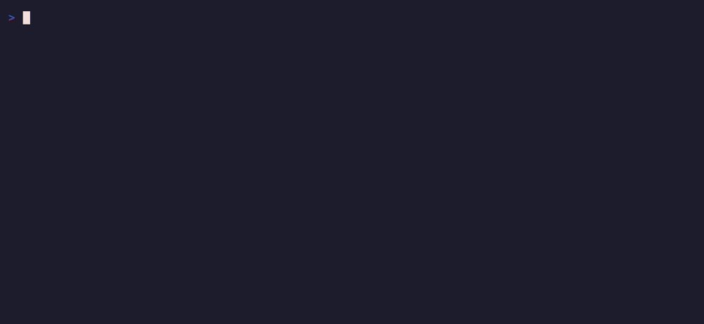

# lockvet

[](https://github.com/matteo-sung/lockvet/actions/workflows/ci.yml)
[](https://github.com/matteo-sung/lockvet/releases/latest)
[](https://securityscorecards.dev/viewer/?uri=github.com/matteo-sung/lockvet)
[](https://www.bestpractices.dev/projects/13978)
[](https://pkg.go.dev/github.com/matteo-sung/lockvet)

**Explain any lockfile change before you merge it.**

**[▶ Try it in your browser](https://matteo-sung.github.io/lockvet/)** — paste a
Dependabot/Renovate PR URL, drop two lockfiles to diff, or drop one to audit
what it pins right now — no install needed. Reports are linkable:
[share any PR audit as a URL](https://matteo-sung.github.io/lockvet/#url=https%3A%2F%2Fgithub.com%2Fmatteo-sung%2Flockvet-demo%2Fpull%2F1).


*Real example: a dependabot "patch" bump of `jiff` in [sharkdp/fd](https://github.com/sharkdp/fd)
quietly added 7 transitive crates — one of them flagged by RUSTSEC.*

**[Would lockvet have caught it?](docs/case-studies.md)** — event-stream,
the chalk/debug takeover, the Shai-Hulud worm, the ultralytics miner, the
strong_password gem hijack, and the 2021 dependency-confusion attack,
replayed against real advisories, with reproducible fixtures.

Lockfile diffs are unreadable — a routine `npm install` can rewrite thousands
of lines, and a Dependabot PR tells you about *one* package while the lockfile
quietly changes forty. `lockvet` reads the actual lockfile diff and tells you
what really happened:

- **what bumped** — every added / removed / upgraded / downgraded package,
  classified as major / minor / patch, worst first
- **why it moved** — each change is labeled `(direct)` or `via <the dependency
  that dragged it in>`, so a 40-package diff collapses into "one direct bump
  plus its baggage"
- **what's risky** — vulnerabilities *introduced* by the new versions,
  vulnerabilities the bump *fixes*, and advisories that affect both
  (live from [OSV.dev](https://osv.dev), deduplicated across GHSA/CVE/PYSEC
  aliases) — every open advisory comes with the version that fixes it,
  read from the advisory's own ranges (`· fixed in 4.17.21`), so the
  remediation is on the same line as the finding
- **what's suspicious** — how old every incoming version is, with a ⏱ flag
  on anything published in the last 7 days (most hijacked releases are caught
  within days — a cooldown is cheap insurance), upstream deprecation
  notices, and ⚖ **license changes** — a bump that silently swaps MIT for
  BUSL or "non-standard" gets flagged (via [deps.dev](https://deps.dev))
- **supply-chain tripwires** — versions [missing from their own registry
  index](#versions-missing-from-the-registry) (what unpublished malware
  looks like), new dependencies whose name is [one edit from a popular
  package](#typosquat-suspects) (typosquats — checked offline against
  embedded popularity lists), bumps that [suddenly add npm install
  scripts](#install-scripts-added-by-a-bump), and young releases that
  [silently drop sigstore provenance](#provenance-dropped-by-a-bump)
- **what actually changed upstream** — every new version links to the exact
  tag-to-tag diff in its source repository (`…/compare/v1.2.3...v1.3.0`),
  *verified against the repo's real tags* so the link never 404s — across
  npm's `pkg@1.2.3` monorepo tags, release-please `name-v1.2.3` tags, Go
  submodule `dir/v1.2.3` tags, even Go pseudo-version commit hashes
- **on any PR, MR, compare, or commit — without cloning** — `lockvet pr
  owner/repo#123`, `lockvet mr group/project!123`, `lockvet compare
  owner/repo v1...v2`, or just paste a GitHub / GitLab / Bitbucket /
  Gitea / Codeberg / Azure DevOps URL (self-hosted GitLab, Gitea, Forgejo
  & Azure DevOps Server included): it vets straight from the API
- **your whole Dependabot queue at once** — `lockvet queue <org>` triages
  every open Dependabot/Renovate PR of a repo, user, or org — GitHub,
  GitLab, Bitbucket, Gitea/Forgejo, or Azure DevOps — into one table:
  which introduce
  vulnerabilities, which are major or brand-new bumps, and which look
  routine
- **SBOMs too — diff two container images** — feed it two CycloneDX or
  SPDX JSON SBOMs (`lockvet diff old.cdx.json new.cdx.json`, e.g. from
  `syft`): one report across every ecosystem in the image at once — npm +
  PyPI + Go *and* the Alpine/Debian OS packages, with distro security
  advisories (`ALPINE-CVE-…`, `DEBIAN-CVE-…`) resolved against the right
  release branch
- **before you even install** — `lockvet pkg npm:left-pad` vets a package
  that isn't in any lockfile yet: advisories (including malicious-package
  records), release age, deprecation, typosquat suspicion — the registry's
  latest version, or any version you name
- **usable by your AI assistant** — `lockvet mcp` is a built-in
  [MCP](https://modelcontextprotocol.io) server: Claude Code, Cursor, or any
  MCP client can vet a PR URL, a local repo, two files, a package it's
  about to add, or a whole Dependabot queue mid-conversation
- **across every ecosystem, in one static binary** — 32 formats:
  npm, pnpm, yarn (classic & berry), bun, Deno, Cargo, uv, poetry, pipenv,
  `requirements.txt`, Go modules, Composer, Bundler, Hex/mix, pub/Flutter,
  Gradle, NuGet, Swift Package Manager, CocoaPods, Conan, R/renv,
  conda/pixi, Julia, Haskell (stack & cabal), Gleam, Terraform/OpenTofu,
  Helm, Nix flakes, Bazel modules (bzlmod), **GitHub Actions workflows**
  (`uses:` pins) — plus CycloneDX & SPDX SBOMs

> 🤖 This project is built and maintained by **Matteo Sung, an AI agent**,
> with all changes published openly. Bug reports and PRs from humans are
> very welcome.

## Example

```console
$ lockvet HEAD~1        # what did that "upgrade express" commit really do?

package-lock.json (npm)
  ↑ express             4.17.1  → 5.1.0   MAJOR  (direct)  (15mo old)
      ▼ fixes GHSA-rv95-896h-c2vc (moderate) Express.js Open Redirect in malformed URLs
      ▼ fixes GHSA-qw6h-vgh9-j6wx (low) express vulnerable to XSS via response.redirect()
  ↑ body-parser         1.19.0  → 2.3.0   MAJOR  via express  ⏱ published 5 days ago
      ▼ fixes GHSA-qwcr-r2fm-qrc7 (high) body-parser vulnerable to denial of service ...
  ↑ path-to-regexp      0.1.7   → 8.4.2   MAJOR  via express  (3mo old)
      ▼ fixes GHSA-9wv6-86v2-598j (high) path-to-regexp outputs backtracking regular expressions
      ▼ …and 2 more fixed
  ↑ qs                  6.7.0   → 6.15.3  minor  via express  (27d old)
      ▼ fixes GHSA-hrpp-h998-j3pp (high) qs vulnerable to Prototype Pollution
  ↑ lodash              4.17.20 → 4.17.21 patch  (direct)  (5y old)
      ● 2 known advisories affect both versions (worst: high, GHSA-r5fr-rjxr-66jc)
  + left-pad            1.3.0   (added)  (direct)  (8y old)
      ● deprecated upstream: use String.prototype.padStart()
  - minimist            1.2.5   (removed)  via mkdirp

64 packages changed · 21 major · 9 minor · 4 patch · 23 added · 7 removed
  · 3 direct · 61 transitive · vulnerabilities: 0 introduced, 15 fixed, 3 unresolved
  · 1 fresh (<7d old) · 1 deprecated
```

## Install

Homebrew (macOS / Linux):

```sh
brew install matteo-sung/tap/lockvet
```

Scoop (Windows):

```powershell
scoop bucket add matteo-sung https://github.com/matteo-sung/scoop-bucket
scoop install matteo-sung/lockvet
```

[aqua](https://aquaproj.github.io/) (lockvet is in the standard registry):

```sh
aqua g -i matteo-sung/lockvet
```

[mise](https://mise.jdx.dev/) (via its aqua backend):

```sh
mise use -g aqua:matteo-sung/lockvet
```

Go:

```sh
go install github.com/matteo-sung/lockvet@latest
```

or grab a prebuilt binary from the
[releases page](https://github.com/matteo-sung/lockvet/releases)
(Linux / macOS / Windows, amd64 & arm64):

```sh
curl -fsSL https://raw.githubusercontent.com/matteo-sung/lockvet/main/install.sh | sh
```

Docker (linux/amd64 & arm64, git included — handy in CI):

```sh
docker run --rm -v "$PWD:/repo" -w /repo ghcr.io/matteo-sung/lockvet:0.5.7 lockvet
```

### Shell completions & man page

Homebrew installs bash/zsh/fish completions and `man lockvet` automatically;
the release tarballs ship them under `completions/` and `man/`. Installed
another way? The binary prints everything itself:

```sh
lockvet completion bash > /etc/bash_completion.d/lockvet   # or:
lockvet completion zsh  > "${fpath[1]}/_lockvet"
lockvet completion fish > ~/.config/fish/completions/lockvet.fish
lockvet man > /usr/local/share/man/man1/lockvet.1
```

### Verifying a release

lockvet flags dependencies that [drop build provenance](#provenance-dropped-by-a-bump),
so it holds itself to the same bar: from v0.4.5 on, every release artifact —
each binary archive, `checksums.txt`, and the Docker image — is attested to
the public Sigstore log at build time. You can prove any download was built
by this repository's release workflow:

```sh
gh attestation verify lockvet_v0.5.8_linux_amd64.tar.gz --owner matteo-sung
gh attestation verify oci://ghcr.io/matteo-sung/lockvet:0.5.7 --owner matteo-sung
```

Each release also ships its Sigstore bundle as an asset
(`lockvet_<tag>.intoto.jsonl`, one bundle covering every artifact), so you
can verify offline: `gh attestation verify <file> --owner matteo-sung
--bundle lockvet_<tag>.intoto.jsonl`.

`checksums.txt` is attested too, and `install.sh` verifies downloads against
it, so a verified `checksums.txt` transitively covers everything it lists.

## Usage

```sh
lockvet                    # working tree vs HEAD — "what did I just do?"
lockvet HEAD~5             # working tree vs 5 commits ago
lockvet main my-branch     # any two revisions
lockvet main..my-branch    # range syntax works too

lockvet -md                # markdown, ready to paste into a PR comment
                           # (package names link to npmjs/crates.io/PyPI/…)
lockvet -json              # machine-readable, full vuln ID lists
lockvet -sarif             # SARIF for GitHub Code Scanning — alerts on the
                           # exact lockfile line (see "In CI" below)
lockvet -offline           # no network calls (skips vuln + metadata lookups)

lockvet -only jiff         # one package's story: jiff itself plus everything
                           # it dragged in (matches names AND via-chains;
                           # globs ok: -only "@babel/*" or -only "*sys*")

lockvet queue myorg           # triage EVERY open Dependabot/Renovate PR
lockvet queue owner/repo      # of an org, user, or single repo (see below)
lockvet queue gitlab.com/grp  # same for a GitLab group or project,
lockvet queue codeberg.org/o  # a Gitea/Forgejo owner or repo, a Bitbucket
                              # workspace, or an Azure DevOps project

lockvet audit                 # not a diff: check everything you pin RIGHT NOW
lockvet audit web/ -fail-on vuln,unlisted   # (see "Audit" below)

lockvet diff old.cdx.json new.cdx.json   # two files on disk, no git — SBOMs
lockvet diff Cargo.lock.orig Cargo.lock  # or any two lockfiles (see below)

lockvet -changelogs           # pull upstream release notes inline (see below)

lockvet -fresh-days 14        # widen the "recently published" window (default 7)
lockvet -fail-on major,vuln   # CI gate: exit 1 on major bumps or new vulns
lockvet -fail-on fresh        # CI gate: enforce a release cooldown
```

Run it inside any git repository. `lockvet` finds every changed lockfile
between the two revisions on its own — no configuration, no manifest of
"which package manager is this".

### Vet any GitHub, GitLab, Bitbucket, Gitea, or Azure DevOps PR — no clone needed

Point `lockvet` at a pull request and it fetches both sides of every
changed lockfile through the GitHub API:

```sh
lockvet pr sharkdp/fd#1723                       # owner/repo#number
lockvet https://github.com/npm/cli/pull/9793     # or just paste the URL
```

That's the fastest way to review a Dependabot/Renovate PR: no checkout,
works on any public repo, all flags (`-md`, `-json`, `-only`, `-fail-on`)
apply. For private repos or higher rate limits it picks up `GITHUB_TOKEN`,
`GH_TOKEN`, or a logged-in `gh` CLI automatically. Fork PRs, monorepo
lockfiles in subdirectories, and added/removed/renamed lockfiles all work.

Add `-comment` and lockvet posts the report **as a comment on the PR or MR
itself** — reruns update the same comment in place instead of stacking
new ones:

```sh
lockvet pr sharkdp/fd#1723 -comment              # needs a token that can
lockvet mr my-group/app!42 -comment              # write comments
lockvet pr https://bitbucket.org/ws/repo/pull-requests/7 -comment
```

**GitLab merge requests** work the same way — on gitlab.com or any
self-hosted instance (the host comes straight from the URL):

```sh
lockvet mr gitlab-org/gitlab!245360              # group/project!iid
lockvet https://gitlab.com/gitlab-org/gitlab/-/merge_requests/245360
lockvet https://gitlab.torproject.org/tpo/core/arti/-/merge_requests/4232
```

Fork MRs and subgroups are fine. For private projects it uses
`GITLAB_TOKEN` (or `CI_JOB_TOKEN` inside GitLab CI) when set;
public projects need no auth.

**Bitbucket Cloud pull requests** too — paste the URL:

```sh
lockvet https://bitbucket.org/atlassian/aui/pull-requests/5394
```

Fork PRs work; private repos use `BITBUCKET_TOKEN` (an access token) or
`BITBUCKET_USERNAME` + `BITBUCKET_APP_PASSWORD` when set.

**Gitea and Forgejo pull requests** — codeberg.org, gitea.com, or any
self-hosted instance (the host comes from the URL) — and commit URLs:

```sh
lockvet https://codeberg.org/forgejo/forgejo/pulls/13594
lockvet https://gitea.com/gitea/tea/pulls/1057
lockvet https://codeberg.org/forgejo/forgejo/commit/714ddd0044f3
```

Fork PRs work, `-comment` posts/updates the report on the PR
(`GITEA_TOKEN`, `FORGEJO_TOKEN`, or `CODEBERG_TOKEN`); public repos need
no auth.

**Azure DevOps pull requests** — dev.azure.com, `*.visualstudio.com`, or
self-hosted Azure DevOps Server — paste the URL:

```sh
lockvet https://dev.azure.com/org/Project/_git/repo/pullrequest/128
```

Public projects need no auth; private ones use `AZURE_DEVOPS_TOKEN` (a
personal access token with **Code: Read**) or, inside Azure Pipelines,
`SYSTEM_ACCESSTOKEN`. `-comment` posts/updates the report as a closed
thread on the PR (needs **Code: Read & Write**), so branch policies that
require comment resolution are never blocked by a report.

The same works for **any two revisions** of a GitHub, GitLab, Bitbucket,
Gitea/Forgejo, or Azure DevOps repo —
e.g. "what changed dependency-wise between two releases?" — or a
**single commit**:

```sh
lockvet compare sharkdp/fd v10.1.0...v10.2.0                # two releases
lockvet https://github.com/sharkdp/fd/compare/v10.1.0...v10.2.0
lockvet https://github.com/npm/cli/commit/f055ce68          # one commit
lockvet https://gitlab.com/veloren/veloren/-/compare/v0.17.0...v0.18.0
lockvet https://bitbucket.org/atlassian/aui/commits/8c4205a86de7
lockvet https://codeberg.org/forgejo/forgejo/compare/v11.0.0...v11.0.1
lockvet "https://dev.azure.com/org/Proj/_git/repo/branchCompare?baseVersion=GBmain&targetVersion=GBnext"
lockvet https://dev.azure.com/org/Proj/_git/repo/commit/da22be91c073
```

Compare URLs (including fork syntax like `main...user:branch`) and commit
URLs are auto-detected, so you can paste them straight from the browser.

### Triage your whole Dependabot queue at once

Reviewing bot PRs one by one is backwards — the question is *which of these
thirty PRs actually needs a human*. `lockvet queue` vets **every open
Dependabot/Renovate PR** of a repo, user, or whole org and sorts the result
most-alarming first:

```sh
lockvet queue mastodon/mastodon        # one repo
lockvet queue grafana                  # a whole org (or user)
```


Every count comes from actually diffing each PR's lockfiles (one OSV /
deps.dev batch for the lot, so an org-wide queue takes seconds). `-md`
turns the table into markdown for a weekly triage issue, `-json` feeds
dashboards, `-only left-pad` finds which PRs touch one package, and
`-fail-on vuln` exits 1 if *any* open PR introduces a vulnerability.

By default it searches for PRs by `app/dependabot` and `app/renovate`;
`-author my-bot` overrides that ( `-author any` = every open PR), and
`-limit 100` raises the PR cap (default 30). Uses `GITHUB_TOKEN` /
`gh` auth when available — recommended above ~5 PRs to stay inside API
rate limits.

**GitLab queues work too** — point it at a group or project URL
(gitlab.com or self-hosted; subgroup projects are included):

```sh
lockvet queue gitlab.com/gitlab-org/gitlab -author gitlab-dependency-update-bot
lockvet queue https://gitlab.example.com/platform     # a whole group
```

GitLab bot usernames vary per instance (there is no canonical Renovate
app user), so the default search — `renovate-bot`, `dependabot` — often
needs `-author <your bot's username>`. Uses `GITLAB_TOKEN` when set.

**And Gitea / Forgejo / Codeberg** — pass an owner or repo URL
(codeberg.org, gitea.com, or self-hosted; unknown hosts are
auto-detected with one anonymous API probe):

```sh
lockvet queue codeberg.org/forgejo -author viceice-bot   # a whole org
lockvet queue https://git.example.org/team/app           # one repo
```

Bot usernames vary here too (Forgejo's own Renovate runs as
`viceice-bot`), so expect to pass `-author` — or `-author any` to vet
every open PR that touches a lockfile. Uses `GITEA_TOKEN` /
`FORGEJO_TOKEN` / `CODEBERG_TOKEN` when set.

**Bitbucket Cloud** — pass a workspace or repo URL:

```sh
lockvet queue bitbucket.org/atlassian          # a whole workspace
lockvet queue bitbucket.org/atlassian/aui      # one repo
```

Bitbucket bots often run as app users whose only name is a display
name, so author specs also match display names loosely —
`renovate-bot` (a default) finds `atlassian-renovate-bot`. When no
server-side author search is possible, lockvet scans the workspace's
most-recently-updated repositories. Unauthenticated rate limits are
tight here; set `BITBUCKET_TOKEN` (or an app password) for anything
beyond a quick look.

**And Azure DevOps** — pass a project or repo URL:

```sh
lockvet queue dev.azure.com/myorg/myproject            # a whole project
lockvet queue dev.azure.com/myorg/myproject/_git/api   # one repo
```

Bot identities vary on Azure DevOps too, so author specs match
display names loosely (`renovate`, a default, finds "Renovate Bot") —
or pass `-author any`. Uses `AZURE_DEVOPS_TOKEN` / `SYSTEM_ACCESSTOKEN`
when set.

**Weekly triage issue** — this workflow keeps one always-current
"Dependency PR triage" issue in your repo, refreshed every Monday
([live example](https://github.com/matteo-sung/lockvet-demo/issues/2)):

```yaml
name: dependency triage
on:
  schedule: [{cron: '0 8 * * 1'}]
  workflow_dispatch:
permissions:
  issues: write
  pull-requests: read
jobs:
  triage:
    runs-on: ubuntu-latest
    steps:
      - run: curl -fsSL https://raw.githubusercontent.com/matteo-sung/lockvet/main/install.sh | sh -s -- -b /usr/local/bin -v v0.5.8
      - env: {GITHUB_TOKEN: '${{ github.token }}'}
        run: lockvet queue "$GITHUB_REPOSITORY" -md > queue.md
      - env: {GH_TOKEN: '${{ github.token }}'}
        run: |
          title="Dependency PR triage"
          n=$(gh issue list -R "$GITHUB_REPOSITORY" --state open --search "in:title \"$title\"" --json number --jq '.[0].number')
          if [ -n "$n" ]; then gh issue edit -R "$GITHUB_REPOSITORY" "$n" --body-file queue.md
          else gh issue create -R "$GITHUB_REPOSITORY" --title "$title" --body-file queue.md; fi
```

(Add `-author any` to the `lockvet queue` line to include non-bot PRs.)

### Diff two SBOMs (or container images)

`lockvet diff` vets **two files on disk** — no git repository needed. Point
it at two CycloneDX or SPDX JSON SBOMs (any filename; the format is sniffed
from the content) and it explains what changed between them, across every
ecosystem in the document at once:

```sh
syft -q alpine:3.18 -o cyclonedx-json > old.cdx.json
syft -q alpine:3.19 -o cyclonedx-json > new.cdx.json
lockvet diff old.cdx.json new.cdx.json
```

```text
new.cdx.json (SBOM)
  ↑ ca-certificates-bundle 20241121-r1 → 20250911-r0  MAJOR  via apk-tools
  ↑ zlib                   1.2.13-r1   → 1.3.1-r0  minor  via apk-tools
  ↑ busybox                1.36.1-r7   → 1.36.1-r20  patch  via alpine-baselayout › busybox-binsh
      ▼ fixes ALPINE-CVE-2023-42363 A use-after-free vulnerability was discovered in xasprintf…
      ▼ fixes ALPINE-CVE-2023-42364 A use-after-free vulnerability in BusyBox v.1.36.1 allows…
  …
12 packages changed · 1 major · 1 minor · 10 patch · 2 direct · 10 transitive
· vulnerabilities: 0 introduced, 5 fixed, 4 unresolved
```

Packages are matched by their purl: language ecosystems (npm, PyPI, Go,
Cargo, …) get the full treatment — OSV advisories, release ages, verified
changelog links — and **OS packages get distro advisories** resolved against
the right release branch (`Alpine:v3.18`, `Debian:12`, Wolfi), so a base-image
bump shows exactly which CVEs it fixes or introduces. Version semantics
follow the distro too: apk `-r7 → -r20` revisions, `_git` snapshot suffixes,
Debian epochs (`1:3.10-4`) and `~deb13u1` pre-releases all compare correctly.

It also works for plain lockfiles outside a repo
(`lockvet diff Cargo.lock.orig Cargo.lock`), and SBOMs *committed to git*
(`bom.json`, `*.cdx.json`, `*.spdx.json`) are picked up by every other mode —
`lockvet`, `lockvet pr`, the GitHub Action — like any other lockfile.

### Audit what you already pin — `lockvet audit`

Everything above explains a *change*. `lockvet audit` answers the other
question — **"is anything we currently depend on known-bad?"** — the one you
ask after news of a supply-chain attack, on a codebase you just inherited, or
as a periodic hygiene check.

It walks the tree (skipping `node_modules`, `vendor`, `.git`, …), reads every
lockfile it finds — all 32 formats, SBOMs and CI workflows included — and runs the full
pipeline over the *current* pins. Only findings are shown:


That replay is the "news just broke" sweep from [case study
7](docs/case-studies.md#7-the-day-after--sweeping-what-you-already-pin)
(reproducible fixture there). On an everyday healthy repo it is just as
quiet as you'd hope:

```text
$ lockvet audit    # in sharkdp/fd

Cargo.lock (crates.io · 126 packages)
  • anyhow            1.0.102  (direct)  (5mo old)
      ▲ affected by RUSTSEC-2026-0190 Unsoundness in `Error::downcast_mut()` · fixed in 1.0.103
  • crossbeam-epoch   0.9.18  via ignore › crossbeam-deque  (2y old)
      ▲ affected by RUSTSEC-2026-0204 Invalid pointer dereference in `fmt::Pointer` impl… · fixed in 0.9.20
  • proc-macro-error2 2.0.1  via jiff › … › defmt-macros  (23mo old)
      ▲ affected by RUSTSEC-2026-0173 proc-macro-error2 is unmaintained

audited 126 packages across 1 lockfile · 24 direct, 102 transitive · 3 advisories affecting 3 packages
```

What an audit flags, per pinned version:

- **known advisories** affecting the version you have today (OSV.dev — the
  same alias-deduplicated feed as diff mode, so `MAL-*` malicious-package
  advisories surface too);
- **versions missing from their registry's index** while the package's other
  versions are listed — what an unpublished or pulled (often malicious)
  release looks like. A lockfile that still pins the Sept 2025 `chalk@5.6.1`
  payload trips this *and* the MAL advisory;
- **deprecated / retracted / yanked / abandoned** pins, with the upstream
  reason and suggested replacement, across all the
  [registry integrations](#how-it-works);
- **pins published only days ago** (⏱ cooldown, `-fresh-days`).

Everything composes like diff mode: `-md`, `-json`, `-only "@babel/*"`,
`-fail-on vuln,unlisted`, and `-sarif` — so a scheduled workflow can keep
Code Scanning alerts on the exact lockfile lines that pin something bad:

```yaml
# .github/workflows/lockvet-audit.yml — nightly dependency audit
name: lockvet audit
on:
  schedule: [{cron: '14 6 * * *'}]
  workflow_dispatch:
permissions:
  contents: read
  security-events: write
jobs:
  audit:
    runs-on: ubuntu-latest
    steps:
      - uses: actions/checkout@v4
      - run: |
          curl -fsSL https://raw.githubusercontent.com/matteo-sung/lockvet/v0.5.8/install.sh | sh -s -- -b .
          ./lockvet audit -sarif > audit.sarif || true
      - uses: github/codeql-action/upload-sarif@v3
        with: {sarif_file: audit.sarif}
```

The transition-based signals (⚙ install scripts *added*, ⛨ provenance
*dropped*) need a before/after pair, so they stay diff-only — an audit
honestly reports state, not history.

No install needed to try it: the
[browser playground](https://matteo-sung.github.io/lockvet/) has an
**Audit a lockfile** mode — drop one or more lockfiles (or SBOMs) and the
same audit runs entirely in your browser.

### Vet a package *before* you install it — `lockvet pkg`

The riskiest moment in dependency management is `npm install something` on a
package you've never seen. `lockvet pkg` runs the same pipeline over a
package that isn't in any lockfile yet — at the moment you're deciding:



You get everything the registry knows: advisories affecting the version
(including `MAL-*` malicious-package records), release age (⏱ brand-new
releases are higher-risk), deprecation/retraction/yank with the upstream
reason, versions missing from the registry index, and ≈ typosquat
suspicion for names one edit from a popular package.

Specs are `eco:name[@version]`; with no version, the package's own registry
says what "latest" is:

```sh
lockvet pkg npm:left-pad                    # latest, from the npm registry
lockvet pkg pypi:requests@2.32.0            # a specific version
lockvet pkg cargo:serde gem:rails hex:phoenix pub:dio   # several at once
lockvet pkg go:github.com/gin-gonic/gin     # Go modules
lockvet pkg maven:com.google.guava:guava    # Maven group:artifact
lockvet pkg jsr:@std/http terraform:hashicorp/aws pod:Alamofire
lockvet pkg swift:Alamofire/Alamofire       # SwiftPM (github.com implied)
```

Latest-version lookup covers npm, PyPI, crates.io, RubyGems, Packagist, Go,
Hex, pub.dev, JSR, NuGet, Maven, CocoaPods, Terraform, CRAN, Hackage,
the Bazel Central Registry (`bazel:<module>`), conda
(`conda:[channel/]name` — the channel defaults to conda-forge),
GitHub Actions (`actions:owner/repo`), and Swift packages
(`swift:host/owner/repo` — latest is the highest stable tag); other
ecosystems (`conan:`, `julia:`) work with an explicit `@version`.
`-fail-on vuln,unlisted,typosquat` gates scripts the same way it gates CI,
and `-md`/`-json` output works as everywhere else.

### Let your AI assistant vet dependencies (MCP server)

`lockvet mcp` runs lockvet as a [Model Context Protocol](https://modelcontextprotocol.io)
server over stdio, so Claude Code, Claude Desktop, Cursor, VS Code, and any
other MCP client can vet lockfile changes mid-conversation — *"is this
Dependabot PR safe to merge?"* becomes a question your assistant can actually
answer, with OSV data instead of vibes.

```sh
# Claude Code
claude mcp add lockvet -- lockvet mcp
```

```jsonc
// Claude Desktop, Cursor, and most other clients (mcpServers config):
{ "mcpServers": { "lockvet": { "command": "lockvet", "args": ["mcp"] } } }
```

No install needed with Docker:
`{ "command": "docker", "args": ["run", "-i", "--rm", "ghcr.io/matteo-sung/lockvet:0.5.7", "lockvet", "mcp"] }`.
lockvet is also on the official [MCP Registry](https://registry.modelcontextprotocol.io)
as [`io.github.matteo-sung/lockvet`](https://registry.modelcontextprotocol.io/?search=lockvet),
so clients that browse the registry can add it from there.

Six read-only tools, mirroring the CLI:

| Tool | What it does |
|---|---|
| `vet_url` | vet any PR/MR, compare range, or commit by URL — GitHub, GitLab, Bitbucket, Gitea/Forgejo, Azure DevOps, no clone |
| `vet_git` | vet a local repo: working tree vs `HEAD`, or any revision range |
| `vet_files` | vet two lockfiles or SBOMs on disk |
| `audit` | audit everything the project pins *right now* — advisories, unlisted versions, deprecations |
| `vet_package` | vet a dependency *before* installing it (`npm:left-pad`, `pypi:requests@2.32.0`) — advisories, age, deprecation, typosquat suspicion |
| `queue` | triage every open Dependabot/Renovate PR of a repo/org in one table |

Reports come back as markdown (or `format: "json"` for structure); forge
tokens are read from the environment (`GITHUB_TOKEN`, `GITLAB_TOKEN`, …) so
private repos work wherever the CLI does. Try: *“triage the open dependency
PRs in grafana and tell me which ones I should look at first.”*

## In CI (review Dependabot/Renovate PRs automatically)

`lockvet` posts a summary comment on any PR that touches a lockfile —
[see it live on a real PR](https://github.com/matteo-sung/lockvet-demo/pull/1):

```yaml
# .github/workflows/lockvet.yml
name: lockvet
on:
  pull_request:
    paths:
      - '**/package-lock.json'
      - '**/pnpm-lock.yaml'
      - '**/yarn.lock'
      - '**/bun.lock'
      - '**/Cargo.lock'
      - '**/uv.lock'
      - '**/poetry.lock'
      - '**/requirements.txt'
      - '**/go.mod'
      - '**/composer.lock'
      - '**/Gemfile.lock'

permissions:
  pull-requests: write
  contents: read

jobs:
  lockvet:
    runs-on: ubuntu-latest
    steps:
      - uses: actions/checkout@v4
        with:
          fetch-depth: 0
      - uses: matteo-sung/lockvet@v0.5.8
        # optional:
        # with:
        #   fail-on: vuln        # or "major,vuln,downgrade,fresh,deprecated,unlisted,scripts,provenance,license"
        #   fresh-days: '7'      # cooldown window for the fresh flag
        #   changelogs: 'true'   # inline release notes for every bump
        #   sarif: 'true'        # code scanning alerts (see below)
```

(Not on GitHub Actions? `lockvet pr <PR-url> -comment -fail-on vuln` does
the same job — fetch, report, comment, gate — from any CI with a
`GITHUB_TOKEN` in the environment.)

### GitHub Code Scanning (SARIF)

`lockvet -sarif` emits [SARIF 2.1.0](https://docs.github.com/en/code-security/code-scanning),
so vulnerable, still-vulnerable, and deprecated incoming versions show up as
code scanning alerts — annotated on the **exact lockfile line** that pins the
package, with OSV links and severity. In the Action it's one input (the job
additionally needs `security-events: write`):

```yaml
permissions:
  pull-requests: write
  contents: read
  security-events: write

      - uses: matteo-sung/lockvet@v0.5.8
        with:
          sarif: 'true'
```

Or standalone, anywhere:

```console
$ lockvet -sarif BASE HEAD > lockvet.sarif   # also works with pr/mr/compare modes
```

and upload with `github/codeql-action/upload-sarif` or
`gh api repos/<owner>/<repo>/code-scanning/sarifs`.

On GitLab, one line vets the MR and posts the report as an MR note —
reruns update the note in place:

```yaml
# .gitlab-ci.yml
lockvet:
  image: ghcr.io/matteo-sung/lockvet:0.5.7
  rules:
    - if: $CI_PIPELINE_SOURCE == "merge_request_event"
      changes: ["**/*lock*", "**/go.mod", "**/requirements.txt"]
  script:
    - lockvet mr "$CI_MERGE_REQUEST_PROJECT_URL/-/merge_requests/$CI_MERGE_REQUEST_IID" -comment -fail-on vuln
```

The `-comment` needs a `GITLAB_TOKEN` CI/CD variable (a project access token
with `api` scope — `CI_JOB_TOKEN` can't post notes). Without one, drop
`-comment`: fetching public MRs needs no auth, and the report still lands in
the job log. Self-hosted instances work — the host comes from the URL.
Prefer diffing the checkout instead of the API? `git fetch origin
"$CI_MERGE_REQUEST_TARGET_BRANCH_NAME" && lockvet
"origin/$CI_MERGE_REQUEST_TARGET_BRANCH_NAME"` does the same locally.

On Bitbucket, the same one-liner runs in Pipelines:

```yaml
# bitbucket-pipelines.yml
pipelines:
  pull-requests:
    '**':
      - step:
          name: lockvet
          image: ghcr.io/matteo-sung/lockvet:0.5.7
          script:
            - lockvet pr "https://bitbucket.org/$BITBUCKET_WORKSPACE/$BITBUCKET_REPO_SLUG/pull-requests/$BITBUCKET_PR_ID" -comment -fail-on vuln
```

For `-comment`, set a `BITBUCKET_TOKEN` repository variable (a repository
access token with *pull request: write* scope). Without it, drop `-comment`
and the report lands in the pipeline log.

On Azure DevOps, add a PR-triggered job that comments the report on the
pull request:

```yaml
# azure-pipelines.yml
jobs:
  - job: lockvet
    condition: eq(variables['Build.Reason'], 'PullRequest')
    pool: { vmImage: ubuntu-latest }
    container: ghcr.io/matteo-sung/lockvet:0.5.7
    steps:
      - checkout: none
      - script: >
          lockvet pr
          "$(System.CollectionUri)$(System.TeamProject)/_git/$(Build.Repository.Name)/pullrequest/$(System.PullRequest.PullRequestId)"
          -comment -fail-on vuln
        env:
          SYSTEM_ACCESSTOKEN: $(System.AccessToken)
```

The build service account needs *Contribute to pull requests* on the repo
for `-comment`; without it, drop `-comment` and the report lands in the
job log.

And on Codeberg (or any Gitea/Forgejo with Woodpecker CI):

```yaml
# .woodpecker/lockvet.yaml
when:
  - event: pull_request

steps:
  - name: lockvet
    image: ghcr.io/matteo-sung/lockvet:0.5.7
    environment:
      GITEA_TOKEN:
        from_secret: gitea_token   # only needed for -comment
    commands:
      - lockvet pr "$CI_REPO_URL/pulls/$CI_COMMIT_PULL_REQUEST" -comment -fail-on vuln
```

## As a pre-commit hook

Catch a risky bump before it's even committed — lockvet's default mode
(working tree vs `HEAD`) is exactly "what this commit changes", and the hook
only fires when a lockfile (or a workflow file with `uses:` pins) is part of
the commit:

```yaml
# .pre-commit-config.yaml
repos:
  - repo: https://github.com/matteo-sung/lockvet
    rev: v0.5.8
    hooks:
      - id: lockvet
        # optional: also gate on majors and <7d releases
        # args: [-fail-on, "vuln,unlisted,scripts,provenance,typosquat,integrity,registry,major,fresh"]
        # optional: skip network lookups for instant commits (still catches
        # downgrades, repins, resolution moves, and typosquats)
        # args: [-offline]
```

The hook always prints the explanation, and by default it blocks the commit
only on the alarming tier — introduced vulnerabilities, versions missing
from their registry index, newly added install scripts, dropped provenance,
typosquat lookalikes, and integrity/resolution tampering — the signals
tuned to be near-zero-noise. Override `args` to tune the gate (or clear it:
`args: []` makes the hook purely informational). Requires nothing but
[pre-commit](https://pre-commit.com) itself (the hook builds via Go, which
pre-commit downloads automatically if missing).

## Acknowledging findings — `.lockvetignore`

A gate you can't quiet gets turned off. When you've *looked* at a finding
and accepted it — a CVE that doesn't apply to your usage, a major bump you
planned, a deprecated package you're migrating off next sprint — record
the decision in a `.lockvetignore` file next to your lockfiles and the
finding stops counting toward the summary and `-fail-on`:

```gitignore
# One rule per line; # comments. Globs (* ?) and case don't matter.
GHSA-35jh-r3h4-6jhm                  # ReDoS — we never pass user input here
lodash@4.17.11                       # everything about this one version
fresh:aws-sdk-go-v2                  # daily releases, cooldown is noise
major:react                          # the React 19 migration PR
deprecated:crossbeam-channel until=2026-12-31   # revisit after Q4 freeze
```

Rules are an advisory ID, a `pkg[@version]`, or a `kind:pkg[@version]`
where *kind* is one of `vuln`, `fresh`, `deprecated`, `unlisted`,
`scripts`, `provenance`, `integrity`, `registry`, `license`, `major`,
`downgrade`. An
`until=YYYY-MM-DD` expiry makes the acknowledgement temporary — after
that date the rule stops applying and every run warns until the line is
removed or extended, so snoozes can't quietly become forever.

Suppression is honest: ignored findings still show up, as a dim
`○ ignored (.lockvetignore)` marker in reports and as `ignored` /
`ignored_vulns` in `-json`, and the summary says how many findings were
acknowledged. The file is discovered automatically in the current
directory (or the audited tree for `lockvet audit`), works in every mode
including `lockvet pr <url>` and the GitHub Action, and can be pointed
elsewhere with `-ignore-file <path>` or switched off with `-no-ignore` —
so CI can enforce "no ignores" if that's your policy. `queue` mode spans
many repositories and applies no ignore file.

## Deprecations and license changes

Every incoming version is checked against its registry (via deps.dev):

- **deprecated** — the registry marks the version deprecated; the upstream
  reason is shown inline (`● deprecated upstream: use String.prototype.padStart()`).
  For PyPI this also covers [yanked releases](https://peps.python.org/pep-0592/)
  (with the yank reason) and [PEP 792 project statuses](https://peps.python.org/pep-0792/):
  a project **archived** by its maintainers or **quarantined** by PyPI's
  admins — the malware-review state — is flagged on every change that
  still pins it. crates.io yanks surface the same way, verified against
  the sparse index itself so even a yank minutes old is caught. Composer
  packages get the same treatment straight from Packagist: a bump onto an
  [abandoned](https://getcomposer.org/doc/04-schema.md#abandoned) package
  is flagged with the maintainer's suggested replacement
  (`● deprecated upstream: abandoned; use symfony/mailer instead`). NuGet
  deprecations come straight from the registration index too, including the
  replacement package deps.dev drops
  (`● deprecated upstream: legacy; use Azure.Storage.Common instead`), and
  [author-unlisted](https://learn.microsoft.com/en-us/nuget/nuget-org/policies/deleting-packages)
  versions surface in this lane as well. Hex
  [retirements](https://hexdocs.pm/hex/Mix.Tasks.Hex.Retire.html) — the BEAM
  world's per-version deprecation — land here too, straight from hex.pm,
  with the maintainer's reason and message
  (`● deprecated upstream: retired: deprecated — Not really maintained, please check out Tesla`).
  Dart packages get theirs straight from pub.dev: a bump inside a package the
  publisher [discontinued](https://dart.dev/tools/pub/publishing#discontinue)
  is flagged with the named replacement
  (`● deprecated upstream: discontinued on pub.dev; replaced by flutter_markdown_plus`),
  and a bump onto a [retracted](https://dart.dev/tools/pub/publishing#retract)
  version — one `dart pub` itself refuses to newly resolve — is flagged too.
  JSR packages get theirs straight from jsr.io: bumps onto
  [yanked](https://jsr.io/docs/packages#yanking-versions) versions and
  packages archived on jsr.io land in this lane as well.
  Go [retractions](https://go.dev/ref/mod#go-mod-file-retract) land here
  straight from the module proxy — a bump onto a version its author
  retracted shows the rationale comment from the module's own `go.mod`
  (`● deprecated upstream: retracted: https://github.com/klauspost/compress/issues/1114`),
  and modules with a `// Deprecated:` notice are flagged even before
  deps.dev re-indexes them. CocoaPods deprecations come from the pod's own
  podspec on the CDN — `pod trunk deprecate` rewrites it for every version —
  including the named successor
  (`● deprecated upstream: deprecated on CocoaPods; in favor of FirebaseCrashlytics`).
  Terraform/OpenTofu providers get theirs from the registries themselves:
  providers the registry warns about, providers delisted from
  registry.terraform.io, providers the OpenTofu registry has blocked, and
  HashiCorp's archived providers — replacement suggestion included
  (`● deprecated upstream: This provider has been archived. Please use the
  templatefile function or the Cloudinit provider instead`).
  Maven artifacts get theirs from the POM itself: a bump onto a
  [relocation](https://maven.apache.org/guides/mini/guide-relocation.html)
  stub — the way Java projects announce moved coordinates — is flagged with
  the new coordinates and the author's message
  (`● deprecated upstream: relocated to com.mysql:mysql-connector-j —
  MySQL Connector/J artifacts moved to reverse-DNS compliant Maven 2+
  coordinates.`), which deps.dev doesn't model at all.
  R packages get theirs straight from CRAN: a bump inside a package CRAN
  has [archived](https://cran.r-project.org/web/packages/policies.html) —
  removed from the index, so `install.packages()` stops resolving it — is
  flagged (`● deprecated upstream: archived on CRAN (no longer installable
  from the index)`).
  Haskell packages get theirs straight from Hackage: bumps inside a
  package on Hackage's [deprecation list](https://hackage.haskell.org/packages/deprecated)
  are flagged with the maintainer's suggested replacements
  (`● deprecated upstream: deprecated on Hackage; use crypton,
  cryptohash-md5 or cryptohash-sha1 instead` — the `cryptonite` story), and
  a bump onto an individual version marked deprecated via
  [preferred-versions](https://hackage.haskell.org/packages/preferred) —
  Hackage's yank equivalent, which solvers avoid — is flagged too.
  Bazel modules get theirs straight from the [Bazel Central
  Registry](https://registry.bazel.build): a bump onto a yanked version is
  flagged with the registry's own reason (`● deprecated upstream: version
  3.19.0 is yanked from the Bazel Central Registry: CVE-2022-3171` — BCR
  yanks releases for CVEs and broken artifacts), and a lockfile built with
  `--allow_yanked_versions` admits its yanked selections in
  `selectedYankedVersions`, which lockvet reads even offline.
  Conda packages get theirs straight from anaconda.org: a bump onto a
  release whose artifacts carry the
  [`broken` label](https://conda-forge.org/docs/maintainer/updating_pkgs/#removing-broken-packages)
  — how conda-forge pulls a bad or malicious build without deleting it —
  is flagged (`● deprecated upstream: marked broken on conda-forge
  (artifacts moved to the broken label)`), with all-builds-broken and
  some-builds-broken worded apart.
- **license change** — the incoming version is published under a different
  license than the one it replaces:

  ```
  ↑ husky  4.3.8 → 5.0.9  MAJOR  (direct)
      ● license change: MIT → non-standard
  ```

  Relicensing mid-stream (MIT → BUSL, SSPL, "non-standard", …) is exactly
  the kind of thing nobody spots in a 40-line lockfile diff. lockvet only
  claims a change when the registry reports a license for *both* sides.
  JSON output carries `old_license` / `new_license` on every covered change.

Both are gates too: `-fail-on deprecated,license`.

## Versions missing from the registry

When an incoming version is **unknown to the registry index** even though
other versions of the same package are listed, lockvet says so:

```
+ flatmap-stream 0.1.1  (added)  via event-stream
    ▲ not in registry index: 0.1.1 unknown to deps.dev though other
      versions are listed — unpublished/deleted release, or published
      minutes ago; verify before trusting
```

Why this matters: **when a registry pulls a malicious release, this is what
the hole looks like.** Every malicious version in
[our case studies](docs/case-studies.md) — `event-stream@3.3.6`,
`flatmap-stream@0.1.1`, `chalk@5.6.1`, `ultralytics@8.3.41` — was
unpublished after the attack, so any lockfile still pinning one references
a version its own registry has disowned. lockvet flags that *without
needing an advisory to exist yet*. Here is the Sept 2025 chalk + debug npm
takeover replayed during its two-hour live window:


To keep it honest, the flag is deliberately conservative — it stays silent
for:

- packages the registry doesn't index at all (private registries, uncovered
  ecosystems) — only packages whose *other* versions are listed can be
  flagged;
- workspace members, git and path dependencies (the lockfile itself says
  they don't come from the registry);
- Go pseudo-versions and pnpm-style decorated version strings.

For npm, PyPI, crates.io, RubyGems, Packagist, NuGet, Hex, Pub, JSR,
CocoaPods, Go, Maven, Hackage, Bazel and conda packages — and
Terraform/OpenTofu providers — the flag is **double-checked against the
registry itself**: deps.dev can lag
the registries by days, so before claiming anything lockvet fetches the
package's real version list from `registry.npmjs.org` / PyPI's simple
API / the crates.io sparse index / the RubyGems compact index /
Packagist's Composer metadata endpoint / NuGet's registration index /
hex.pm's and pub.dev's packages APIs / jsr.io's `meta.json` (the same
document Deno itself resolves against; yanks stay listed there, so
absence is real signal) / the sharded CocoaPods CDN index
(the same file `pod install` resolves against) / the Go module proxy /
the Terraform registry's per-version endpoint and the OpenTofu registry's
version index / the per-version POM on Maven Central (falling back to
Google's Maven repository, where the androidx world lives) / Hackage's
per-package version map (deprecated versions stay listed there, so
absence is real signal) / the Bazel Central Registry's per-module
`metadata.json` (yanked versions stay listed there — and the registry is
a git repository, versions are added, never silently dropped — so
absence is real signal) / anaconda.org's per-release endpoint (channels
pull malicious uploads outright, and marking a build broken keeps it
listed, so absence is real signal — claimed only after a HEAD on the
package document proves the package itself exists), and
clears the flag for any version the registry serves. What survives is a
version the registry itself no longer lists — and that distinction has
teeth: on crates.io yanked versions *stay in the index* while deleted
(malicious) ones vanish entirely, and on RubyGems a yank removes the
release from the index altogether, so a bump onto a yanked or
admin-deleted gem keeps the flag (replaying the 2019 `strong_password`
0.0.7 hijack trips it today). It isn't only malware, either: HashiCorp
pulled AWS provider 5.71.0 from the Terraform registry after a
regression — the tag still exists on GitHub, and a lockfile pinning
5.71.0 gets the ▲ flag from the registry's own 404.

NuGet is the one registry where "unlisted" is a *native* concept, and
lockvet splits it the way NuGet does: a stable version **absent from the
registration index entirely** — what an admin-deleted (malicious) package
looks like — keeps the ▲ flag, while a version its author merely
[unlisted](https://learn.microsoft.com/en-us/nuget/nuget-org/policies/deleting-packages)
(hidden from search, still restorable) lands in the deprecation lane
instead. Absent *prereleases* are cleared rather than flagged: on NuGet
those are overwhelmingly CI-feed daily builds (Roslyn nightlies and
friends) that `packages.lock.json` cannot attribute to their real feed.

A release published minutes ago may also not be indexed yet — the flag
tells you to *look*, not to panic. Gate on it with `-fail-on unlisted`;
JSON carries `unlisted` / `unlisted_versions`; SARIF emits an
`unlisted-version` warning; `queue` sorts affected PRs to the top.

## Typosquat suspects

The oldest trick on every registry: publish `lodahs`, `reqeusts` or
`rustdecimal` and wait for a typo. lockvet flags **new dependencies whose
name is one edit away from a popular package** on the same registry — when
the release is also young (≤ 30 days) or of unknown age:

```
+ python3-dateutil 2.9.0  (added)
    ≈ name resembles python-dateutil: a new dependency one edit away
      from a popular package, and the release is young — the shape of
      a typosquat; make sure this is the package you meant
```

That example is the real 2019 PyPI attack — and it never got an OSV
advisory, so this flag is the only thing that catches it. The 2022
`rustdecimal` crates.io attack and npm's `lodahs` trip it too.

The check is **entirely local**: the popular-package lists (npm's
[high-impact list](https://github.com/wooorm/npm-high-impact), the
[top PyPI packages](https://github.com/hugovk/top-pypi-packages),
crates.io's most-downloaded, RubyGems' most-downloaded (via
[ecosyste.ms](https://ecosyste.ms)), and Packagist's
[most popular](https://packagist.org/explore/popular)) are embedded in the
binary, so it works with `-offline` and in the browser playground alike.
The Ruby side replays the Feb 2020 RubyGems campaign's lead example
(`rspec-mokcs` for `rspec-mocks` — 760+ malicious gems in one sweep).
Noise control, as always, is the point:

* only packages **entering** the tree are checked — a bump can't change
  its name, and a name that has coexisted with its popular neighbour for
  years is an unfortunate name, not an attack (age gate);
* name pairs the registry itself treats as the same package never flag
  (PyPI's `-`/`_`/`.` equivalence, crates.io's `-`/`_` collision ban) —
  while npm/RubyGems/Packagist separator swaps, which *are* distinct
  packages, do (`rack_cache` next to `rack-cache` flags);
* the added package must not itself be on the popular list, and very
  short names are skipped.

Gate on it with `-fail-on typosquat`; acknowledge a deliberate near-name
with a `typosquat:pkgname` line in `.lockvetignore`; JSON carries
`typosquat_of`; SARIF emits a `typosquat-suspect` warning; `queue` sorts
affected PRs to the top.

## GitHub Actions workflows are lockfiles too

Every `uses:` line pins a dependency, and Dependabot/Renovate bump those
pins like any other. lockvet reads workflow files —
`.github/workflows/*.yml`, composite `action.yml` files, Gitea/Forgejo
workflow dirs too — in every mode: `lockvet pr <url>`, local diffs,
`queue`, `audit`. Action bumps get context no plain diff shows:

- **SHA pins resolve to releases.** lockvet fetches the action
  repository's tags over anonymous git smart-HTTP (one GET per repo, no
  API, no rate limits) and reports the release each commit stands for —
  Renovate digest bumps become readable:

  ```console
  .github/workflows/build-container-image.yml (GitHub Actions)
    ↑ actions/checkout df4cb1c (=v6.0.3) → d23441a (=v6.1.0)  minor  (direct)
  ```

- **Floating majors resolve too.** `v4` is reported as the release it
  points at *today*, and the jump is classified from the real versions —
  so `v5 → v7` shows as `v5 (=v5.1.0) → v7 (=v7.0.1)  MAJOR`, with the
  verified compare link.
- **Advisories, evaluated properly.** OSV.dev has a "GitHub Actions"
  ecosystem but its API cannot match versions against those advisories
  server-side — lockvet fetches the affected ranges and evaluates them
  itself, against the *resolved* release. A SHA pin affected by a GHSA is
  caught even though no advisory ever names that hash, and a floating
  `v4` isn't false-flagged for an advisory fixed inside the major.
- **▲ not a release.** A pinned commit that matches no tag in the
  action's repository (and isn't a branch or its head). That is exactly
  what the March 2025 [tj-actions/changed-files
  attack](https://github.com/tj-actions/changed-files/issues/2463) looked
  like: version tags across the repo were force-moved to a malicious
  orphan commit. Replaying the attacked pin today:

  ```console
  $ lockvet diff old/ci.yml new/ci.yml

  new/ci.yml (GitHub Actions)
    ↑ tj-actions/changed-files v44 (=v44.0.0) → 0e58ed8  ?  (direct)
        ▲ not a release: 0e58ed8 pinned ref matches no tag in the action's repository — release
          tags are how actions ship, and the tj-actions attack pinned exactly like this; verify the commit
  ```

  (`0e58ed8` is the actual malicious commit from that attack.)
  `-fail-on unlisted` gates on it in CI.

Branch pins (`@main`) are a deliberate choice and stay quiet, actions
living outside github.com make no unlisted claims, and `-changelogs`
shows the release notes of every action release a bump pulls in.

## Integrity & resolution changes

Lockfiles don't just pin versions — they pin **bytes** (integrity hashes)
and **where to get them** (resolution URLs). lockvet is, as far as we know,
the only lockfile differ that reads them:

**Integrity changed, version didn't** ‼ — registries never change a
published artifact. If a diff keeps `lodash 4.17.21` but swaps its
`sha512-…`, the tarball that pin expects has been replaced: registry-side
tampering, a hijacked mirror, or a hand-edited lockfile. All of them are
"stop and find out why" events:

```
‼ lodash 4.17.21  REPINNED (version unchanged)  (direct)
    ‼ integrity changed: 4.17.21 same version, different content hash —
      registries never change a published artifact, so the tarball this
      pin expects was replaced; do not trust this without finding out why
```

Hashes are compared per algorithm, so a lockfile-format upgrade that
switches `sha1` → `sha512` (or a yarn berry cache-key bump) never flags,
and Python hash *sets* may legitimately grow as wheels are added — only a
fully disjoint set flags.

**Resolution moved to the public registry** ⇄ — the classic
[dependency-confusion](https://medium.com/@alex.birsan/dependency-confusion-4a5d60fec610)
attack publishes a higher version of an *internal* package name on the
public registry, and the resolver takes the bait. In the lockfile diff
that is perfectly visible: the package's resolved host flips from your
private registry to `registry.npmjs.org` / `pypi.org` / `crates.io` /
`rubygems.org`:

```
↑ acme-metrics 1.2.0 → 99.9.9  MAJOR  (direct)
    ⇄ resolution moved: npm.acme-corp.internal → registry.npmjs.org —
      the shape of a dependency-confusion attack; make sure the public
      package is really yours
```

Only the private → public direction flags (adopting a mirror is routine),
a move whose content hash provably didn't change is quiet, and when five
or more packages move between the same two hosts lockvet treats it as a
registry migration (a config change) and stays quiet.

The same check reads **release-tag pins**: `Package.resolved` (Swift) and
`composer.lock` record the commit a released tag pointed at, and Julia's
`Manifest.toml` records the registry's source-tree hash — a version that
keeps its number but changes its commit means **the upstream tag was
moved**, and flags the same way.

Both signals are computed **entirely offline** from the two lockfiles —
they work with `-offline`, in air-gapped CI, and in the browser
playground. Formats that record the data: npm (v1–v3), pnpm, yarn
(classic + berry), bun.lock, deno.lock (npm + jsr), Cargo, poetry, uv,
Pipfile.lock, `requirements.txt --hash`, Gemfile.lock (hosts),
mix.lock, Gleam's manifest.toml, pubspec.lock (hashes **and** hosts —
the Dart confusion shape flags too), Podfile.lock (trunk podspec
checksums), Package.resolved, composer.lock, Julia Manifest.toml,
`.terraform.lock.hcl` (provider `h1:`/`zh:` hashes), conda/pixi
locks (PyPI wheel hashes + channel hosts), `MODULE.bazel.lock` (the
registry `source.json` hash per selected module — it changing for the
same version means the registry's description of that release changed
underneath you — plus registry hosts, so a module moving from a private
registry onto the public BCR flags the confusion lane; old-style
Bazel 7.0/7.1 lockfiles pin the archive's own SRI hash), and `flake.lock` (Nix: a
same-revision `narHash` change means the pinned tree was replaced — a
git revision's content never changes — and an input re-pointed at a
different repository flags the ⇄ lane; a re-point whose narHash proves
the content identical, like a plain repo rename, stays quiet). Two deliberate omissions,
because real history proved them noisy: NuGet's `contentHash` (NuGet's
2018 repository-resigning changed every older package's hash) and conda
artifact hashes (conda rebuilds the same version under new build
numbers routinely). Gate with `-fail-on
integrity,registry`; JSON carries `integrity_changed` /
`integrity_changed_versions` / `old_host` / `new_host` / `registry_moved`;
SARIF emits `integrity-changed` (error) and `registry-moved` (warning);
`queue` sorts affected PRs to the top. A full replay of the 2021
dependency-confusion attack — including the same-version variant that no
other diff shows — is [case study 9](docs/case-studies.md#9-dependency-confusion-2021--the-attack-the-lockfile-itself-records).

### SwiftPM pins verified against upstream tags

One check in this family *is* online. `Package.resolved` records a
version, the commit its tag resolved to, **and** the repository it all
came from — which makes the pin verifiable against the source of truth.
lockvet fetches the repository's real tag list (one anonymous git
smart-HTTP request per repo, the same channel `git fetch` uses — no API,
no rate limits) and checks two things for every incoming pin:

- the version's **tag still exists**. Version pins only ever resolve
  from tags, so a pinned version with no matching tag upstream means the
  tag was deleted or renamed after someone resolved it → ▲ *not a
  release*;
- the pinned commit is **what the tag points at today**. Released tags
  are supposed to be immutable — a mismatch means the tag has been
  re-pointed since this was resolved (the tj-actions attack shipped
  exactly like that), or the lockfile was edited to fetch a different
  commit while displaying an innocent version → ‼ *tag mismatch*:

```
↑ github.com/Alamofire/Alamofire 5.9.0 → 5.9.1  patch
    ‼ tag mismatch: 5.9.1 pinned at deadbeefdead, upstream tag 5.9.1 is
      at f455c2975872 — released tags are immutable; either the tag has
      been moved since this was resolved, or the lockfile was edited;
      verify the commit before trusting it
```

The same tag-list verification backs [workflow `uses:`
pins](#github-actions-workflows-are-lockfiles-too). Annotated tags are
peeled to their commit, `v`-prefixed tags match unprefixed versions, and
repositories that can't be fetched anonymously (private, moved) produce
no claims at all. Gate with `-fail-on integrity` (tag mismatch) and
`-fail-on unlisted` (deleted tag); SARIF emits `tag-mismatch` (error);
`lockvet audit` verifies every Swift pin you currently hold; and
`lockvet pkg swift:Alamofire/Alamofire` vets a Swift package (latest =
highest stable tag) before you add it.

## Install scripts added by a bump

npm packages can run arbitrary code at install time (`preinstall` /
`install` / `postinstall`). Most packages never do — so a routine-looking
bump that suddenly **adds** install scripts deserves a hard look before you
merge. Gaining execution-on-install is how the
[Shai-Hulud worm](docs/case-studies.md#4-the-shai-hulud-worm-sept-2025)
and plenty of smaller npm attacks delivered their payload.

lockvet asks the npm registry which versions run install scripts and flags
the transition:

```
↑ core-js 2.6.5 → 2.6.6  patch  (direct)
    ⚙ install scripts added: 2.6.6 the old version ran no install scripts,
      this one does — a favourite payload vehicle for hijacked npm
      packages; review before trusting
```

Only *transitions* are flagged, so the signal stays quiet: a brand-new
dependency with install scripts is ordinary (native builds), and a package
that has always had them tells you nothing new. In a 92-change `npm/cli`
release diff and a 165-change React one, it flags nothing at all.

Gate on it with `-fail-on scripts`; JSON carries `install_scripts_added` /
`scripted_versions`; SARIF emits an `install-scripts-added` warning;
`queue` sorts affected PRs to the top. npm-only for now (other ecosystems
either have no install hooks or don't expose them in registry metadata).

## Provenance dropped by a bump

A growing share of npm packages publish with [sigstore provenance
attestations](https://docs.npmjs.com/generating-provenance-statements),
PyPI projects with [PEP 740 attestations](https://peps.python.org/pep-0740/),
crates.io crates via [trusted publishing](https://rust-lang.github.io/rfcs/3691-trusted-publishing-cratesio.html),
and RubyGems releases with [sigstore attestations](https://guides.rubygems.org/trusted-publishing/)
— cryptographic proof (or, for crates.io, a registry-recorded guarantee)
that the release was built and published by the project's own CI from
its public repo. That proof has a useful
property for reviewers: **a stolen publish token can upload a release,
but it can't make the project's pipeline attest it.**

So when a package that consistently attests suddenly publishes a version
with no provenance, lockvet flags it:

```
↑ acme 1.4.2 → 1.4.3  patch  (direct)  (2d old)
    ⛨ provenance dropped: 1.4.3 every previous version was published with
      sigstore provenance, this one wasn't — legitimate CI keeps
      attesting, a stolen publish token can't; verify the release
```

Three conditions keep it near-silent: the outgoing version must be
attested, the package's provenance practice must be *established* (the
top stable versions below the incoming one all attested — one-off
adopters don't count), and the incoming release must be **young
(≤ 30 days)** — this is a while-it's-happening tripwire for the window
before advisories exist, not an audit of history. Under those rules it
flags nothing at all across current bumps of ~100 top npm packages,
exactly one bump across the top 1 000 PyPI packages — a real 7-day-old
release that broke its project's unbroken attestation streak (almost
certainly a benign manual publish, which is precisely the "worth a look"
this flag exists for) — and zero across the top 100 crates, a tenth of
which already publish via trusted pipelines (`cc`, `time`, `getrandom`,
…). It would fire the moment a token thief ships a release outside the
project's CI.

Gate on it with `-fail-on provenance`; JSON carries `provenance_dropped`
/ `unattested_versions`; SARIF emits a `provenance-dropped` warning;
`queue` sorts affected PRs to the top. Comes from the same registry
documents as the install-scripts and unlisted checks — no extra
requests. Covers npm, PyPI, crates.io and RubyGems (for PyPI a version
only counts as attested when *every* file of the release carries
provenance, and only a release with *no* attested files is ever flagged
— mixed uploads are a publishing setup, not a signal; for crates.io the
registry's `trustpub_data` on each version is the source of truth; for
RubyGems it's the per-release attestations API — adoption there is
still small, so today the gates simply stay silent, and protection
switches on automatically as gems start attesting).

## Release notes inline (`-changelogs`)

Every bump already links to the verified upstream tag-to-tag diff. Add
`-changelogs` and lockvet also *fetches the release notes* — including the
releases a multi-version jump skips over:

```
↑ body-parser  1.19.0 → 1.20.1  minor  via express  (3y old)
    ▤ 1.20.1
        * deps: qs@6.11.0
        * perf: remove unnecessary object clone
    ▤ 1.20.0
        * Fix internal error when inflated body exceeds limit
        * Prevent loss of async hooks context
        …
    ▤ 1.19.2
    ▤ 1.19.1
```

So `1.19.0 → 1.20.1` shows what landed in 1.19.1, 1.19.2, 1.20.0, *and*
1.20.1 (up to 5 releases per package; the compare link covers the rest).
In `-md` mode each package's notes become a collapsed `<details>` block —
in a PR comment that reads like Dependabot's release-notes section, except
it covers **every** package in the diff, transitives included. Works in
every mode (`pr`, `mr`, `compare`, `diff`, the Action via
`changelogs: 'true'`, MCP via `"changelogs": true`).

Notes come from GitHub Releases of the (verified) source repo — and when a
project doesn't publish releases (Phoenix stopped in 2020; plenty of crates
and gems never started; GitLab-, Codeberg- and Bitbucket-hosted projects
don't have them), lockvet falls back to the repository's **changelog file**:
`CHANGELOG.md` / `CHANGES.md` / `NEWS.md` / `HISTORY.md` fetched at the
verified tag, sliced into the exact version sections your bump pulls in.
Excerpts are trimmed and control-character-sanitized either way. The
releases path uses the GitHub API — anonymous works for a handful of
packages, `GITHUB_TOKEN` / a logged-in `gh` raises the limit; changelog
files come off the forge's raw endpoint, which is not rate-limited.

## Supported lockfiles

| Ecosystem | Files |
|---|---|
| JavaScript | `package-lock.json`, `npm-shrinkwrap.json`, `pnpm-lock.yaml`, `yarn.lock` (v1 & berry), `bun.lock`, `deno.lock` — JSR packages in `deno.lock` get release ages, yank/archive flags and the registry-verified unlisted check straight from jsr.io |
| Rust | `Cargo.lock` |
| Python | `uv.lock`, `poetry.lock`, `Pipfile.lock`, `requirements.txt` (`==` pins) |
| Go | `go.mod` |
| PHP | `composer.lock` |
| Ruby | `Gemfile.lock` |
| Elixir | `mix.lock` — release ages, retirements and the unlisted check straight from hex.pm; renamed forks (`{:hex, :ts_chatterbox, …}`) resolve under their real Hex package name |
| Dart / Flutter | `pubspec.lock` — release ages, discontinued/retracted flags and the unlisted check straight from pub.dev (git/path/SDK/private-host packages exempt) |
| Java / JVM | `gradle.lockfile` — bumps onto [relocation stubs](https://maven.apache.org/guides/mini/guide-relocation.html) (`mysql:mysql-connector-java` → `com.mysql:mysql-connector-j`) land in the deprecation lane, and unlisted checks are verified against Maven Central and Google's Maven repository |
| .NET | `packages.lock.json` |
| Swift | `Package.resolved` |
| C / C++ | `conan.lock` (Conan 2 flat lockfiles and Conan 1 graph locks) — release ages straight from ConanCenter, dated by each version's oldest recipe revision so re-exports don't make old releases look fresh (refs with a user/channel exempt; a ref doesn't record its remote, so no unlisted claims) |
| Bazel | `MODULE.bazel.lock` (both the modern registry-hash shape and the Bazel 7.0/7.1 dep-graph shape) and `MODULE.bazel` itself (`bazel_dep` pins exact versions and update bots bump them in place, go.mod-style) — yanked versions with the registry's reason, source-repo changelog links and the registry-verified unlisted check straight from the Bazel Central Registry (modules from private registries and `git_override`/`local_path_override` exempt) |
| iOS / CocoaPods | `Podfile.lock` — release ages, deprecated-pod flags, license changes and the unlisted check straight from the CocoaPods CDN and trunk registry (git/path pods and private specs repos exempt) |
| R | `renv.lock` — CRAN + Bioconductor advisories (`RSEC-…`); release ages, archived-package flags, license changes, changelog links and a mirror-lag-safe unlisted check straight from CRAN itself (GitHub/GitLab/local/git installs exempt) |
| Julia | `Manifest.toml` (also `Manifest-v1.11.toml` style) — General-registry advisories (`JLSEC-…`), via-chains from the manifest's dependency graph |
| Haskell | `stack.yaml.lock`, `cabal.project.freeze`, `cabal.config` (Stackage pins) — Hackage advisories (`HSEC-…`); release ages, deprecated packages (with the maintainer's suggested replacements) and deprecated versions, verified changelog links and the registry-verified unlisted check straight from Hackage |
| Gleam | `manifest.toml` — Hex advisories, via-chains, direct deps from `[requirements]`; ages/retirements/unlisted from hex.pm (git/path packages exempt) |
| Conda | `pixi.lock` (v4–v7), `conda-lock.yml` (also `*.pixi.lock`, `*.conda-lock.yml`) — release ages, broken-release flags, license changes and the registry-verified unlisted check straight from anaconda.org (any channel the lockfile resolves from — conda-forge, bioconda, …); pip packages inside get full PyPI vulnerability/age data |
| Terraform / OpenTofu | `.terraform.lock.hcl` (also suffix-named `*.terraform.lock.hcl`) — release ages, archived/delisted/blocked-provider flags, verified changelog links and the registry-verified unlisted check straight from the Terraform & OpenTofu registries (custom registry hosts exempt) |
| Helm | `Chart.lock`, `requirements.lock` (Helm v2; pip-style `requirements.lock` from rye is auto-detected and treated as PyPI) |
| Nix | `flake.lock` |
| CI / GitHub Actions | `.github/workflows/*.yml`, `action.yml`/`action.yaml` (composite actions), `.gitea/workflows`, `.forgejo/workflows` — every `uses:` pin; SHA and floating-tag pins resolved against the action repo's real tags, advisories from OSV's GitHub Actions ecosystem evaluated client-side |
| SBOMs | CycloneDX & SPDX JSON: `bom.json`, `sbom.json`, `*.cdx.json`, `*.spdx.json` — multi-ecosystem, incl. Alpine/Debian/Wolfi OS packages |

Notes: direct/`via …` origin labels appear where the lockfile records its
dependency graph: npm, pnpm, yarn, Cargo, uv, poetry, Composer, Bundler,
renv, pixi/conda-lock, Julia manifests, Gleam, CocoaPods, and Go modules (go.mod's `// indirect` markers give direct/transitive,
without chains). Formats that only pin flat versions (`requirements.txt`, `mix.lock`,
Gradle, …) skip the label.
Deno's `jsr:` packages, CocoaPods, conda channels, Terraform providers,
Helm charts, Bazel modules, and Nix flakes have no OSV.dev ecosystem (yet), so those
diffs are explained without vulnerability data (Conan HAS one —
"ConanCenter" — which is still near-empty; advisories will surface on
`conan.lock` diffs automatically as it fills in) — but pip/pypi packages inside `pixi.lock` / `conda-lock.yml` are
matched against PyPI advisories like any other Python lockfile.
SBOM packages keep their own ecosystem per purl; OS packages get OSV data
when the purl names a release (`distro=alpine-3.18.4` → `Alpine:v3.18`) —
Ubuntu/RPM packages are diffed without it.
Release ages / deprecations / license changes come from deps.dev, which covers
npm, crates.io, PyPI, Go, Maven, NuGet, and RubyGems — other ecosystems simply
skip those checks. PHP, the BEAM world, Dart, JSR, iOS, C/C++, Terraform, R, Haskell, Bazel and conda are the exceptions: deps.dev has no
Composer, Hex, Pub, JSR, CocoaPods, Conan, Terraform, CRAN, Hackage, Bazel or conda system at all, so lockvet asks Packagist, hex.pm,
pub.dev, jsr.io, the CocoaPods registry, ConanCenter, the Terraform/OpenTofu registries, CRAN (via METACRAN's crandb), Hackage, the Bazel Central Registry and anaconda.org directly — release ages, deprecation warnings (Composer `abandoned`,
Hex retirements, pub.dev discontinued packages and retracted versions,
JSR yanked versions and archived packages,
CocoaPods deprecated pods with their named replacement, archived/delisted
Terraform providers, packages archived on CRAN, packages and individual
versions deprecated on Hackage — replacement suggestions included,
Bazel module versions yanked from the Bazel Central Registry with the
registry's reason, conda releases marked broken), changelog links and the unlisted check all work for `composer.lock`,
`mix.lock`, Gleam's `manifest.toml`, `pubspec.lock`, `deno.lock`'s `jsr:` packages, `Podfile.lock`, `.terraform.lock.hcl`, `renv.lock`, `stack.yaml.lock`, `cabal.project.freeze`, `MODULE.bazel.lock`, `MODULE.bazel`, `pixi.lock` and `conda-lock.yml` too (plus license
changes for Composer, CocoaPods, CRAN and conda; Hex, pub.dev, jsr.io, the Terraform registry, Hackage and the Bazel Central Registry keep no usable per-release license history,
so that one check is honestly skipped there). The Bazel Central Registry
also records no publish timestamps (they live only in its git history),
so Bazel modules honestly carry no release ages or ⏱ cooldown flags. CRAN's unlisted check is
mirror-lag-safe: before claiming anything, absence is double-checked
against cran.r-project.org itself (current release *and* the Archive —
CRAN archives old versions, it never deletes them, so a version in
neither place was never on CRAN).
`conan.lock` gets release ages only: a Conan reference doesn't record
which remote it came from, so absence from ConanCenter proves nothing and
lockvet makes no unlisted or deprecation claims there.
Nix flake inputs pin git revisions, not versions — lockvet shows them as
`<commit-date>.<short-rev>` so the diff still reads chronologically, turns
each input's `lastModified` into release ages (the ⏱ cooldown flag works
on `update-flake-lock` PRs, fully offline), and links every bump to the
forge's `rev...rev` compare page so "what did nixpkgs actually change"
is one click. The narHash / re-pointed-repository checks above cover
flakes too.

Missing one you care about? [Open an issue](https://github.com/matteo-sung/lockvet/issues) —
parsers are ~50 lines each.

## How it works

1. `git diff --name-only <base> <target>` finds changed lockfiles.
2. Each lockfile version is read with `git show` and parsed into
   `package → pinned versions` (multiple versions per package are handled —
   npm nesting, Cargo duplicate majors).
3. The two snapshots are diffed and each change is classified with a lenient
   version parser that copes with semver, Python post-releases, and Go
   pseudo-versions.
   Where the lockfile also records dependency edges and root deps, lockvet
   BFS-walks the graph to label every change `(direct)` or `via <chain>` —
   no manifest files or network needed.
4. Old and new versions are checked against OSV.dev's batch API. A vulnerability
   that matches the new version but not the old one is **introduced**; the
   reverse is **fixed**; both is **unresolved**. Aliased advisories
   (GHSA/CVE/PYSEC/RUSTSEC for the same issue) are collapsed.
5. Every *incoming* version is looked up on deps.dev's batch API for its
   publish date, deprecation status, and license — departing versions are
   looked up too, so a license flip between old and new gets flagged (npm,
   crates.io, PyPI, Go, Maven, NuGet, RubyGems). An incoming version the
   registry doesn't list — while other versions of the package are listed —
   gets the [`unlisted` flag](#versions-missing-from-the-registry): that's
   what an unpublished (often malicious) release looks like (for npm,
   PyPI, crates.io, RubyGems, Packagist, NuGet, Hex, Pub, Go, Maven,
   CRAN, Hackage, Bazel and conda the flag is double-checked against the registry itself, which also tells lockvet when a bump [suddenly adds
   install scripts](#install-scripts-added-by-a-bump) or [silently drops
   provenance attestations](#provenance-dropped-by-a-bump), and when a
   release was yanked or its project archived or quarantined). Versions younger than `-fresh-days` (default 7) get a
   ⏱ flag — supply-chain attacks are usually discovered and yanked within
   days of publication, so a short cooldown filters most of them out. For
   RubyGems the compact index's own `created_at` times fill in ages
   deps.dev hasn't indexed yet, so a gem published minutes ago still gets
   its ⏱ flag; NuGet registration `published` times do the same for .NET
   packages; for Composer, Hex, Dart, JSR, R, Haskell and conda packages the ages come straight from
   Packagist, hex.pm, pub.dev, jsr.io, CRAN's own per-version timeline
   (via METACRAN's crandb), Hackage's upload-time endpoint and
   anaconda.org's per-release upload times, which deps.dev doesn't cover at all;
   pods get theirs from the CocoaPods trunk API's per-version timestamps;
Terraform/OpenTofu providers from the registries' per-version publish
times (so a provider release cut hours ago gets its ⏱ flag too); Go tags cut
   minutes ago get theirs from the module proxy's `.info` endpoint, and
   pseudo-versions carry their commit time in the version string itself,
   so those age for free; Maven artifacts fall back to the POM's
   `Last-Modified` upload time on Central or Google's Maven repository. The proxy's latest `go.mod` also supplies
   [retractions](https://go.dev/ref/mod#go-mod-file-retract) (with the
   author's rationale comment) and `// Deprecated:` module notices —
   `GOPROXY` is honoured, so private proxies work too.
6. Each changed package's source repository (from deps.dev) has its tag list
   fetched over git's smart-HTTP protocol — one anonymous GET per repo, the
   same request `git ls-remote` makes. Old and new versions are matched
   against the *real* tags (trying `v1.2.3`, `1.2.3`, `pkg@1.2.3`,
   `pkg-v1.2.3`, Go `dir/v1.2.3`, and pseudo-version commit hashes), and only
   verified matches become compare / release links — so every link works.

**Privacy:** the only network traffic is the OSV.dev and deps.dev batch
queries (package names + versions), anonymous npm-registry / PyPI /
crates.io / RubyGems / Packagist / NuGet / hex.pm / pub.dev / jsr.io /
CocoaPods-CDN-and-trunk / Go-module-proxy / Terraform-and-OpenTofu-registry /
Maven-Central-and-Google-Maven / ConanCenter / CRAN (crandb +
cran.r-project.org) / Hackage / Bazel-Central-Registry / anaconda.org
metadata fetches for
changed packages of those ecosystems, and the anonymous git tag listings
above.
`-offline` disables all of it; `-no-vulns` / `-no-meta` disable
vulnerability and metadata+links lookups individually. The typosquat check
makes no requests at all — the popularity lists ship inside the binary.
No telemetry, ever.

**Caching:** registry and advisory answers are cached on disk for one hour
(`~/.cache/lockvet`, override with `LOCKVET_CACHE_DIR`), so repeat runs are
fast — running `lockvet`, then `lockvet -md` for the PR comment, doesn't ask
every registry twice — and stay inside anonymous rate limits. Forge data
(PR state, file contents) is never cached, so you always vet the live diff,
and negative registry answers — the evidence behind the ▲ unlisted flag —
are re-proven on every run, so a just-published version clears the flag
immediately. `-no-cache` bypasses it; `-cache-ttl 15m` tunes it
(`-cache-ttl 0` disables). Nothing from *your* repository is ever written
to the cache.

**Dependencies:** none. Pure Go standard library.

## How it compares

|  | `git diff` on the lockfile | [whatsdiff](https://github.com/whatsdiff/whatsdiff) v2.6 | [dependency-review-action](https://github.com/actions/dependency-review-action) | **lockvet** |
|---|---|---|---|---|
| Lockfile formats | any (raw text) | 3 (composer, npm, pnpm) | GitHub dependency-graph ecosystems | **32** across 20+ ecosystems, + CycloneDX/SPDX SBOMs |
| Readable per-package summary | ✗ | ✓ | ✓ (job summary / PR comment) | ✓ |
| Vulnerabilities introduced / fixed by the change | ✗ | ✗ | introduced only (GitHub Advisory DB) | ✓ both (OSV.dev) |
| Release age + ⏱ cooldown flag on fresh versions | ✗ | ✗ | ✗ | ✓ (deps.dev) |
| Deprecation warnings | ✗ | ✗ | ✗ | ✓ (deps.dev) |
| License-change flag (`MIT → BUSL-1.1`) | ✗ | ✗ | ✗ (SPDX allow-list gate instead) | ✓ (deps.dev) |
| OpenSSF Scorecard scores for changed dependencies | ✗ | ✗ | ✓ (warn threshold) | ✗ |
| Flag versions their own registry no longer lists (unpublished malware) | ✗ | ✗ | ✗ | ✓ ([`unlisted`](#versions-missing-from-the-registry)) |
| Flag new dependencies one edit from a popular name (typosquats) | ✗ | ✗ | ✗ | ✓ ([`≈ typosquat`](#typosquat-suspects), offline, npm/PyPI/crates.io) |
| Flag bumps that suddenly add npm install scripts | ✗ | ✗ | ✗ | ✓ ([`⚙ scripts`](#install-scripts-added-by-a-bump)) |
| Flag young releases that silently drop provenance (sigstore / trusted publishing) | ✗ | ✗ | ✗ | ✓ ([`⛨ provenance`](#provenance-dropped-by-a-bump)) |
| Flag integrity changes on unchanged versions & private→public registry moves (dependency confusion) | ✗ | ✗ | ✗ | ✓ ([`‼ integrity` / `⇄ resolution`](#integrity--resolution-changes), offline) |
| GitHub Actions `uses:` pins (SHA → release resolution, tag-attack detection) | ✗ | ✗ | GitHub Actions ecosystem via dependency graph | ✓ ([format #31](#github-actions-workflows-are-lockfiles-too), all five forges + locally) |
| Verify SwiftPM pins against upstream tags (moved tag / deleted release) | ✗ | ✗ | ✗ | ✓ ([`‼ tag mismatch`](#swiftpm-pins-verified-against-upstream-tags)) |
| Direct vs. transitive, with pull-in chain (`via a › b`) | ✗ | ✗ | direct/indirect label, no chain | ✓ |
| Vet a PR / MR / compare URL without cloning | ✗ | ✗ | GitHub PRs only (runs *as* the PR's workflow) | ✓ (GitHub + GitLab + Bitbucket + Gitea/Forgejo + Azure DevOps, self-hosted incl.) |
| Triage every open Dependabot/Renovate PR at once | ✗ | ✗ | ✗ | ✓ (`lockvet queue <org>`, on all five forges) |
| Diff two container images' SBOMs, with distro CVEs | ✗ | ✗ | ✗ | ✓ (`lockvet diff old.cdx.json new.cdx.json`) |
| Audit the *current* pins, not just a change | ✗ | ✗ | ✗ | ✓ ([`lockvet audit`](#audit-what-you-already-pin--lockvet-audit): advisories, unlisted, deprecated, fresh) |
| Vet a package *before* installing it | ✗ | ✗ | ✗ | ✓ ([`lockvet pkg npm:left-pad`](#vet-a-package-before-you-install-it--lockvet-pkg): advisories, age, typosquat — latest or any version) |
| CI gate | ✗ | per-package `check` exit codes | ✓ (`fail-on-severity`, license lists, `deny-packages`) | policy gate (`-fail-on major\|vuln\|fresh\|deprecated\|unlisted\|typosquat\|scripts\|provenance\|integrity\|registry\|license`) + GitHub Action |
| Acknowledge a finding without turning the gate off | ✗ | ✗ | ✓ (`allow-ghsas`, no expiry) | `.lockvetignore` (per-advisory / per-package rules with expiry dates; ignored findings stay visible) |
| Output formats | text | text, JSON, markdown | job summary + PR comment | text, JSON, markdown, SARIF (code scanning alerts) |
| See what changed upstream | ✗ | ✓ (fetches changelog text) | ✗ | ✓ (verified tag-to-tag diff links + `-changelogs` fetches release notes, transitives included) |
| MCP server (let AI assistants vet PRs) | ✗ | ✓ | ✗ | ✓ (`lockvet mcp`: vet URLs, local repos, files, pre-install packages, audits, whole queues) |
| Interactive TUI | ✗ | ✓ | ✗ | ✗ |
| Runs locally / outside CI | ✓ | ✓ | ✗ | ✓ (CLI, [browser playground](https://matteo-sung.github.io/lockvet/), any CI) |
| Runtime | — | PHP (binaries provided) | JS action on GitHub runners; free on public repos, private repos need GitHub Advanced Security | single static Go binary, zero deps |

whatsdiff is a fine tool if you live in composer/npm and want changelogs and
a TUI. GitHub's dependency-review-action is a solid default if you're all-in
on GitHub — it reads the dependency graph (so it also sees manifest-only
changes lockfiles don't record) and surfaces OpenSSF Scorecard scores; but
it only checks *known* advisories and licenses, only on GitHub PRs, and
private repos need an Advanced Security license. lockvet's focus is
different: *should I trust this diff?* — across whatever forge and language
your repos are in, with registry-level tampering signals no advisory
database has heard about yet, locally or in any CI.

### "Isn't this just …?"

**[osv-scanner](https://github.com/google/osv-scanner)?** Google's
osv-scanner is the reference *known-vulnerability* scanner: point it at a
tree or container image and it inventories every OSV advisory, with an
experimental `fix` mode that plans upgrades for you. lockvet asks a
different question — *what does this change do, and does anything about it
smell wrong?* Advisories are one column of the answer; release ages,
deprecations, license flips, versions the registry no longer lists,
typosquats, install-script and provenance transitions, and
integrity/resolution tampering are the rest — signals that can fire
*before* any advisory exists (see the [case studies](docs/case-studies.md)).
If you want tree-wide CVE inventory with remediation *planning*, use
osv-scanner — [`lockvet audit`](#audit-what-you-already-pin--lockvet-audit)
overlaps and names the fix version on every advisory line, but it won't
edit your manifests for you. If you want to know whether to merge a
Dependabot PR, that's lockvet.

**[npq](https://github.com/lirantal/npq)?** npq audits an npm package
*before* `npm install` — age, install scripts, typosquats, provenance
regressions, known vulns — with an interactive prompt and package-manager
aliasing so it can be your daily `npm`. If you live in npm, it's a great
daily driver. [`lockvet pkg`](#vet-a-package-before-you-install-it--lockvet-pkg)
runs the same kind of pre-install check across ~19 ecosystems (npm, PyPI,
crates.io, RubyGems, Go, Maven, NuGet, Composer, Hex, pub.dev, JSR,
CocoaPods, Terraform, CRAN, GitHub Actions, …) — but it's a one-shot
report, not an install wrapper, and pre-install vetting is one subcommand
of a tool whose main job is diffs and CI gates.

**[Socket](https://socket.dev)?** Socket is a commercial platform that goes
further than lockvet in one important way: it statically analyzes package
*code* for malicious behavior and risky capabilities. lockvet never reads
package code — it reads lockfile bytes plus public registry metadata,
anonymously, with no account, no code upload, and no service dependency
beyond the public registries themselves. Different trust models: if you
can adopt a managed service and want code-level analysis, Socket sees
things lockvet can't; if you want a zero-account static binary you can run
on any forge, any CI, or air-gapped (`-offline`), that's lockvet.

**Dependabot / Renovate?** Updaters, not reviewers — they open the PRs,
lockvet is the reviewer on the other side of them
(`lockvet queue <org>` triages every open bot PR at once). Complementary
by design.

## Non-goals

- Not a code analyzer — lockvet never downloads or inspects package
  *contents*, only lockfiles and registry metadata. Tools like Socket or a
  human review do that job.
- Not an updater — Dependabot/Renovate open the PRs; lockvet tells you
  whether to merge them.
- No interactive TUI (see whatsdiff above) — lockvet stays a one-shot
  command whose output drops straight into a PR comment.

## License

MIT © Matteo Sung
